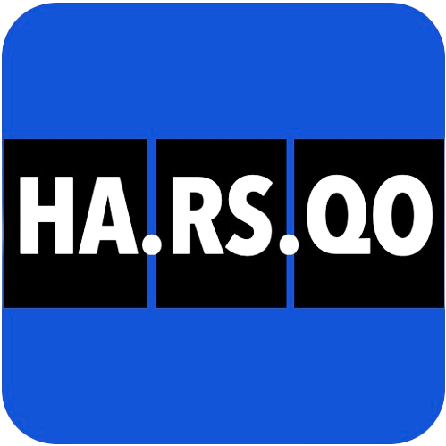

<div align="center">
  

  # HA.RS.QO
  **AI-Powered HS Code Classifier**

  *Built with **GAP OS** using **The Signal Hunter Framework***

  [](#)
  [](LICENSE)
  [](#)
  [](https://kenangeyyas.substack.com/p/free-tools)
</div>

---

> 🚧 **ACTIVE DEVELOPMENT**
>
> This project is currently in early development phase.  
> Core engine, data models, and UI are under active construction.  
> First stable release will be published soon.

---

## 🌍 Overview

**HA.RS.QO** is an open-source HS Code classification tool designed for global trade workflows.

It aims to reduce friction in customs classification by helping users map product descriptions to Harmonized System (HS) codes in a structured and explainable way.

Incorrect classification in global trade can lead to:
- Customs delays  
- Unexpected duties and taxes  
- Compliance risks  
- Financial penalties  

HA.RS.QO is designed to help reduce these risks through structured classification assistance.

---

## ⚙️ Current State

This project is currently in early build phase.

- Architecture: In progress  
- Core classification engine: Under development  
- UI: Prototype stage  
- Data models: Experimental  
- Public release: Coming soon  

---

## 🏗️ Ecosystem

HA.RS.QO is part of a broader open-source trade intelligence toolkit:

**Kenan Geyyas ➔ GAP OS ➔ The Signal Hunter Framework ➔ Free Tools**

- 🎯 **HA.RS.QO** (`hs-code-classifier`): *You are here.*
- 📊 **tarifio** (`tariff-calculator`): Tariff Calculator for Importers and Exporters
- ⚖️ **PROVENI** (`fta-rules-of-origin`): Free Trade Agreement compliance verification
- 📦 **Netto** (`landed-cost-calculator`): Landed Cost Calculator to Estimate Total Import Duties, Freight and Sourcing Fees
- 🛡️ **COMPILA** (`supplier-compliance-tool`): Framework for Supplier Compliance Audits, Risk Assessments and Supply Chain Vetting

All tools are being developed under the **GAP OS ecosystem**.

---

## ✨ Planned Features

- Planned AI-assisted HS code classification engine  
- Top-3 prediction results  
- Confidence scoring system  
- Bulk CSV classification support  
- Exportable results (CSV format)  
- Country-specific classification logic  

---

## 🚀 Getting Started

### Prerequisites
This repository is currently in active development. Codebase structure is being finalized.

### Installation

```bash
git clone https://github.com/kgeyyas/hs-code-classifier.git
cd hs-code-classifier
```


### 🧠 System Design Philosophy

HA.RS.QO is designed around three core principles:

Transparency over black-box results
Practical usability over theoretical complexity
Speed and clarity in decision-making

The goal is not just classification, but decision support for global trade workflows.


### 🗺️ Roadmap

Built with GAP OS using the Signal Hunter Framework

**Phase 1: Core Foundation (Current)**
- Public open-source release
- Basic classification engine
- Clean UI structure
- Initial documentation
- MIT License
  
**Phase 2: Product Maturity**
- Confidence scoring
- Top-3 predictions
- CSV upload support
- Bulk classification
- Country-specific logic
- CSV export
  
**Phase 3: Intelligence & Automation**
- Real-time tariff data integration
- REST API
- LLM-assisted classification layer
- Community contribution system
- Performance optimization
  
**Phase 4: GAP OS Integration**
- AI feedback learning loop
- Trade intelligence integration
- Cross-tool interoperability within GAP OS ecosystem


### 🤝 Contributing

Contributions are welcome after the initial public release.

- Developers
- Trade and customs experts
- Data scientists
- Supply chain professionals

Contributions to improve global trade infrastructure are greatly appreciated.

Please open an issue before submitting major changes.


### 📄 License

This project is licensed under the MIT License. See LICENSE for more information.


### 🔗 About GAP OS

GAP OS (Gap Operating System) is a decision framework for identifying market opportunities, validating signals, and building systems before they become obvious.

The Signal Hunter Framework is the methodology behind GAP OS. It focuses on identifying weak market signals early and transforming them into structured, practical systems and tools.


## 👤 Author

**Kenan Geyyas**  
Building open-source trade intelligence systems with GAP OS.

<p align="left">
  <a href="https://www.linkedin.com/in/kenan-geyyas/">
    
  </a>

  <a href="https://kenangeyyas.substack.com">
    
  </a>

  <a href="https://x.com/k_geyyas">
    
  </a>
</p>


